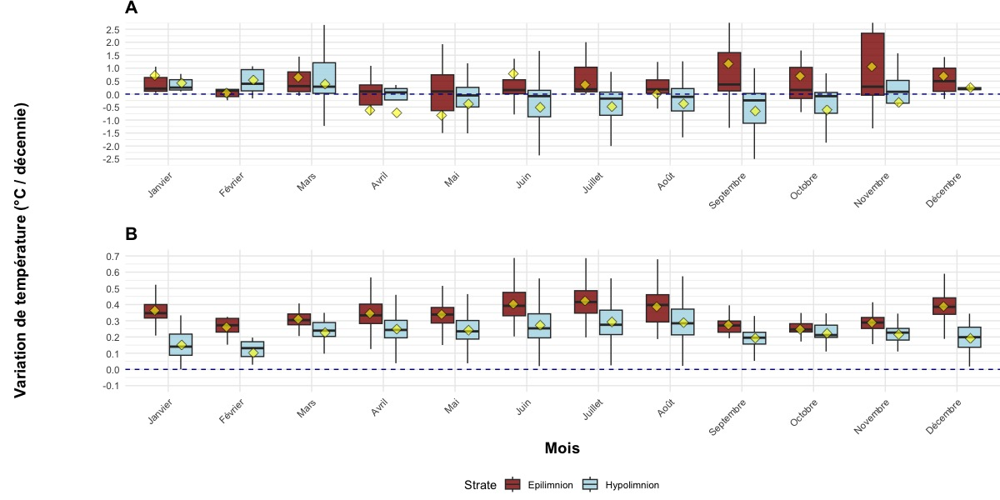
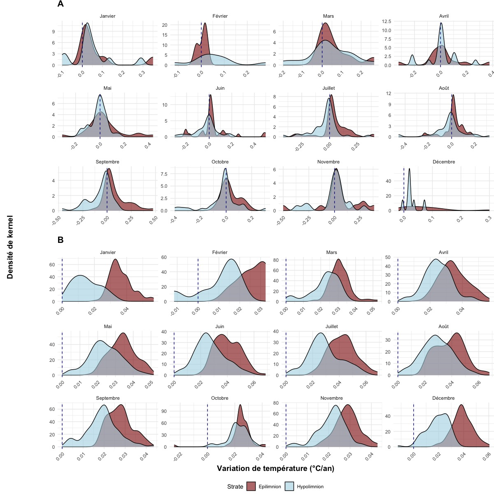

# 🌍 Étude du réchauffement thermique des lacs – Mini-projet ECOMONT 2024

Ce dépôt contient les données, scripts et figures associés à un mini-stage réalisé dans le cadre du master **ECOMONT** (USMB) au **CARRTEL** (INRAE, Thonon-les-Bains), durant une semaine en décembre 2024.

## Sujet

**Étude de la variation du régime thermique des lacs à l’échelle nationale et mondiale dans les zones littorales et pélagiques, sous l’effet du réchauffement climatique.**

Les lacs, en tant que sentinelles du climat, permettent d’observer finement les effets du changement climatique. Cette étude vise à mieux comprendre la dynamique thermique des couches **épilimnion** (superficielle) et **hypolimnion** (profonde), et à estimer les flux de **carbone organique minéralisé** associés.

##  Objectifs

- Comparer les vitesses de réchauffement des strates thermiques (épilimnion vs hypolimnion),
- Contraster les tendances à l’échelle **nationale (France)** et **globale (822 lacs)**,
- Estimer les quantités de **carbone minéralisé** (CH₄ + CO₂) libérées selon la température.

##  Données

- **Jeu global** : 822 lacs avec séries temporelles de température à différentes profondeurs (1921–2022),
- **Jeu national** : 210 lacs français simulés via le modèle OKPLM (1959–2020),
- Analyse des strates selon des seuils de profondeur (1 m pour l’épilimnion, ≥ 90 % Zmax pour l’hypolimnion).

## Méthodes

-  Régression de **Theil-Sen** (robuste aux outliers) pour estimer les vitesses de réchauffement par strate et par mois,
-  Régression linéaire avec interaction (strate × mois) pour estimer les écarts de tendance,
-  Estimation du **carbone minéralisé** via les équations de Gudasz et al. (2010),
-  Analyses statistiques réalisées sous **R** avec les packages `trend`, `emmeans`, `MuMIn`.

##  Résultats clés

-  Un **découplage thermique significatif** entre épilimnion et hypolimnion, plus net à l’échelle nationale,
-  L’épilimnion se réchauffe **1.5 à 2× plus vite** que l’hypolimnion,
-  À l’échelle mondiale, des lacs présentent un **refroidissement de l’hypolimnion**,
-  Une augmentation des **flux de carbone minéralisé** est projetée jusqu’en 2100, particulièrement dans les couches superficielles.

##  Visualisations

---

###  Comparaison des strates par boxplot



---

###  Densité des variations de température



---

###  Minéralisation du carbone (projection jusqu'en 2100)


---

##  Contenu du dépôt

```bash
├── scripts/            # Scripts R d’analyse statistique
├── figures/            # Figures du rapport (température, minéralisation)
├── rapport/            # Rapport PDF du mini-stage
└── README.md           # Ce fichier
